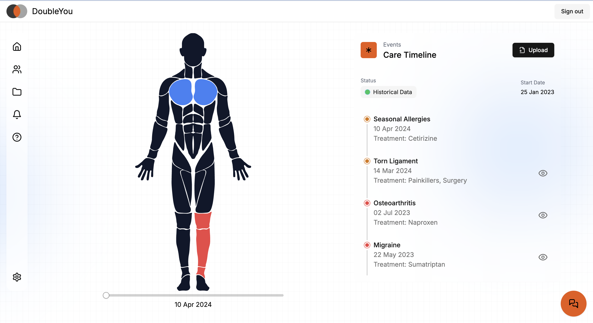

# DoubleYou
Effortlessly track your health data and access personalized medical expert level insights, all at your fingertips.



## Introduction
__Problem:__ Healthcare is complex and fragmented

__Solution:__ A *Digital Doctor* that serves as an accurate mirror of you, providing personalized health insights, proactive care, and seamless health management.

Our digital doctor consists of three core components:

### (Legs) Universal Information Processor
- **AI-driven medical document processor** that serves as the foundation for tracking your health. Upload documents and images securely, consolidating all your health data in one safe location.

### (Core) Digital Health Twin and Healthcare Agents
- **Highly accurate digital health representation** of yourself, offering real-time insights and conversational healthcare assistants. Understand your health better, and summarize your current situation easily for healthcare professionals.

### (Brain) Future Health Simulator
- **Simulating your future health trajectory** to identify future healthcare needs and explore treatment options, including risks and side effects. All information is personalized based on your digital health twin.


## Getting Started

### Prerequisites
- Python 3.7+
- Node.js 14+
- npm or yarn
- Docker (for running Supabase locally)

### Installation

1. Clone the repository:
   ```bash
   git clone https://github.com/your-username/doubleyou.git
   cd doubleyou
   ```

2. Create and activate a virtual environment:
   ```bash
   python3 -m venv venv
   source venv/bin/activate
   ```

3. Install dependencies:
   ```bash
   pip install -r requirements.txt
   npm install
   ```

4. Set up environment variables:
   Create a `.env` file in the root directory and add:
   ```
   MISTRAL_API_KEY=your_mistral_api_key_here
   ```

5. Install Supabase CLI:
   Follow the instructions at https://supabase.com/docs/guides/cli to install the Supabase CLI for your operating system.

6. Start Supabase locally:
   ```bash
   supabase start
   ```

7. Set up Prisma:
   ```bash
   npx prisma generate
   ```

### Running the Project

To run both the Next.js frontend, FastAPI backend, and local Supabase instance concurrently:

```bash
npm run dev
```

This will start:
- Next.js frontend on http://localhost:3000
- FastAPI backend on http://localhost:8000
- Supabase Studio on http://localhost:54323

### Database Management

- To view and manage your local database, access Supabase Studio at http://localhost:54323
- To update your database schema:
  1. Modify your Prisma schema in `prisma/schema.prisma`
  2. Run migrations:
     ```bash
     npm run migrate
     ```
  3. Generate Prisma client:
     ```bash
     npm run generate
     ```

- To open Prisma Studio for database visualization:
  ```bash
  npm run db
  ```

## API Endpoints

The project includes several API endpoints:

1. `/api/py/mistral` (POST): Chat with the Mistral AI model
2. `/api/py/pixtral` (POST): Analyze images using the Pixtral model
3. `/medical_summary` (POST): Generate a medical summary from a list of medical events
4. `/simulate` (POST): Simulate future medical events based on current medical history

## Key Features

- **AI-powered Chat**: Interact with a medical AI assistant using the Mistral model.
- **Image Analysis**: Upload and analyze medical images or documents using the Pixtral model.
- **Medical Summary Generation**: Automatically generate concise medical summaries from a series of medical events.
- **Health Simulation**: Predict potential future health events based on current medical history.

## Tech Stack

- Frontend: Next.js 14
- Backend: FastAPI (Python)
- AI Models: Mistral AI, Pixtral
- Database: Prisma (as indicated in package.json)
